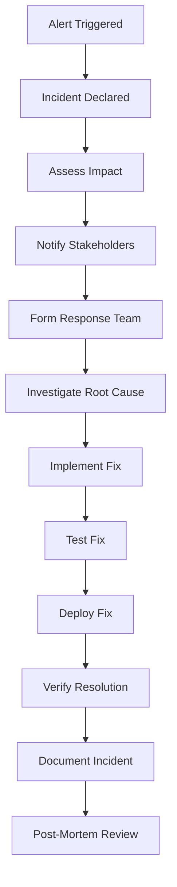

# 🔧 Operational Runbook
## FinanceAnalyst Pro Production Operations

**Version:** 2.0.0
**Last Updated:** $(date)
**Environment:** Production

---

## 📋 Table of Contents

1. [Emergency Contacts](#emergency-contacts)
2. [System Overview](#system-overview)
3. [Daily Operations](#daily-operations)
4. [Monitoring & Alerting](#monitoring--alerting)
5. [Incident Response](#incident-response)
6. [Deployment Procedures](#deployment-procedures)
7. [Maintenance Procedures](#maintenance-procedures)
8. [Backup & Recovery](#backup--recovery)
9. [Performance Optimization](#performance-optimization)
10. [Security Procedures](#security-procedures)

---

## 🚨 Emergency Contacts

### Primary Contacts
- **Technical Lead:** DevOps Engineer (devops@financeanalyst.pro)
- **Product Owner:** Product Manager (pm@financeanalyst.pro)
- **Security Officer:** Security Team (security@financeanalyst.pro)

### Escalation Matrix
```
┌─────────────────┬──────────────────┬─────────────────┐
│ Severity Level  │ Response Time    │ Escalation      │
├─────────────────┼──────────────────┼─────────────────┤
│ Critical (P0)   │ < 15 minutes     │ Immediate       │
│ High (P1)       │ < 1 hour         │ Tech Lead       │
│ Medium (P2)     │ < 4 hours        │ Product Owner   │
│ Low (P3)        │ < 24 hours       │ Team Lead       │
└─────────────────┴──────────────────┴─────────────────┘
```

### 24/7 Support
- **PagerDuty:** #financeanalyst-emergency
- **Slack:** #production-alerts
- **Phone:** +1-800-FINANCE (emergency line)

---

## 🏗️ System Overview

### Architecture Components

```
┌─────────────────┐    ┌─────────────────┐    ┌─────────────────┐
│   CloudFront    │    │      S3         │    │   Route 53      │
│   CDN Layer     │◄──►│  Static Assets  │◄──►│   DNS Service    │
│                 │    │                 │    │                 │
│ • Global CDN    │    │ • HTML/CSS/JS   │    │ • Domain Mgmt   │
│ • Edge Caching  │    │ • Media Files   │    │ • Health Checks │
└─────────────────┘    └─────────────────┘    └─────────────────┘
┌─────────────────┐    ┌─────────────────┐    ┌─────────────────┐
│   WAF & Shield  │    │   Lambda@Edge   │    │   CloudWatch    │
│ Security Layer  │◄──►│   Functions     │◄──►│   Monitoring    │
│                 │    │                 │    │                 │
│ • DDoS Protection│    │ • API Gateway   │    │ • Metrics       │
│ • Rate Limiting  │    │ • Edge Compute  │    │ • Logs          │
└─────────────────┘    └─────────────────┘    └─────────────────┘
```

### Service Dependencies

| Service | Purpose | SLA | Contact |
|---------|---------|-----|---------|
| AWS CloudFront | CDN & Edge Computing | 99.9% | aws-support@amazon.com |
| AWS S3 | Static File Storage | 99.999999999% | aws-support@amazon.com |
| AWS Route 53 | DNS Management | 100% | aws-support@amazon.com |
| AWS CloudWatch | Monitoring & Logging | 99.9% | aws-support@amazon.com |
| AWS WAF | Web Application Firewall | 99.9% | aws-support@amazon.com |
| GitHub Actions | CI/CD Pipeline | 99.5% | github-support@github.com |

---

## 📅 Daily Operations

### Morning Checklist (9:00 AM)

```bash
# 1. Check system health
curl -f https://app.financeanalyst.pro/health

# 2. Review overnight metrics
npm run monitor:metrics

# 3. Check for alerts
npm run monitor:alerts

# 4. Review error logs
npm run logs:search -- --since "24 hours ago"

# 5. Verify backup status
npm run backup:list
```

### Key Metrics to Monitor

| Metric | Threshold | Action |
|--------|-----------|--------|
| **Response Time** | > 2 seconds | Investigate performance |
| **Error Rate** | > 5% | Check application logs |
| **Availability** | < 99.9% | Escalate to P1 |
| **Traffic** | > 10x normal | Enable rate limiting |
| **Storage Usage** | > 80% | Plan capacity increase |

### End of Day Checklist (6:00 PM)

```bash
# 1. Generate daily report
npm run monitor:health

# 2. Archive logs
npm run logs:archive

# 3. Update documentation
npm run docs:update

# 4. Plan tomorrow's tasks
npm run maintenance:schedule
```

---

## 📊 Monitoring & Alerting

### Alert Categories

#### 🔴 Critical Alerts (P0)
- **System Down**: Application unavailable
- **Data Loss**: User data corruption
- **Security Breach**: Unauthorized access detected
- **Performance Degradation**: >50% performance drop

#### 🟠 High Alerts (P1)
- **High Error Rate**: >10% error rate
- **Service Degradation**: Partial system failure
- **Resource Exhaustion**: >90% resource usage
- **Security Threat**: Suspicious activity detected

#### 🟡 Medium Alerts (P2)
- **Performance Warning**: >2 second response time
- **Resource Warning**: >80% resource usage
- **Configuration Drift**: Environment mismatch

#### 🟢 Low Alerts (P3)
- **Informational**: System notifications
- **Maintenance**: Scheduled maintenance alerts
- **Performance Trends**: Usage pattern changes

### Alert Response Procedures

#### Critical Alert Response
```bash
# 1. Acknowledge alert immediately
npm run alert:acknowledge --alert-id $ALERT_ID

# 2. Assess impact
npm run incident:assess

# 3. Notify stakeholders
npm run notify:stakeholders --severity critical

# 4. Begin incident response
npm run incident:start

# 5. Deploy emergency fix or rollback
npm run deploy:rollback --environment production

# 6. Communicate with users
npm run maintenance:enable --message "Emergency maintenance in progress"
```

#### Standard Alert Investigation
```bash
# 1. Gather context
npm run alert:investigate --alert-id $ALERT_ID

# 2. Check recent changes
npm run deploy:status

# 3. Review logs
npm run logs:search --alert-id $ALERT_ID

# 4. Analyze metrics
npm run monitor:metrics --timeframe "1 hour"

# 5. Determine root cause
npm run incident:analyze

# 6. Implement fix or mitigation
npm run incident:resolve
```

---

## 🚨 Incident Response

### Incident Response Process



### Incident Severity Classification

| Severity | Description | Examples | Response Time |
|----------|-------------|----------|---------------|
| **P0** | Critical | Complete system outage, data loss | < 15 minutes |
| **P1** | High | Major feature broken, significant user impact | < 1 hour |
| **P2** | Medium | Minor feature issues, partial degradation | < 4 hours |
| **P3** | Low | Cosmetic issues, informational | < 24 hours |

### Communication Templates

#### User-Facing Communication
```html
<!-- Status Page Update -->
<div class="status-update">
    <h3>🔄 System Maintenance</h3>
    <p>We are currently experiencing technical difficulties.</p>
    <p><strong>Status:</strong> Investigating</p>
    <p><strong>Estimated Resolution:</strong> 2 hours</p>
    <p>We apologize for any inconvenience.</p>
</div>
```

#### Internal Communication
```markdown
## Incident Report

**Incident ID:** INC-2024-001
**Severity:** P1
**Status:** Investigating
**Start Time:** 2024-01-15 14:30 UTC
**Affected Systems:** Web Application
**Impact:** ~20% of users affected

### Current Status
- Investigating root cause
- Monitoring system metrics
- Coordinating with engineering team

### Next Steps
- Complete root cause analysis
- Implement temporary mitigation
- Deploy permanent fix
- Conduct post-mortem review

### Communication
- Users notified via status page
- Stakeholders updated via Slack
- Engineering team mobilized
```

---

## 🚀 Deployment Procedures

### Pre-Deployment Checklist

```bash
# 1. Code Quality Checks
npm run quality:audit
npm run test:full-suite
npm run perf:audit

# 2. Security Validation
npm run security:audit
npm run test:security

# 3. Build Validation
npm run build:prod
npm run build:validate

# 4. Environment Checks
npm run env:check --environment production

# 5. Backup Verification
npm run backup:create
npm run backup:validate
```

### Deployment Execution

#### Automated Deployment (Recommended)
```bash
# Trigger CI/CD deployment
git push origin main

# Or manual trigger
npm run ci:deploy:production
```

#### Manual Deployment (Emergency)
```bash
# 1. Prepare deployment
npm run predeploy

# 2. Execute deployment
npm run deploy:production

# 3. Verify deployment
npm run deploy:status

# 4. Run post-deployment checks
npm run postdeploy
```

### Post-Deployment Validation

```bash
# 1. Health checks
npm run monitor:health

# 2. Smoke tests
npm run test:smoke

# 3. Performance validation
npm run perf:check

# 4. User acceptance
npm run test:e2e:ci

# 5. Monitoring activation
npm run monitor:enable
```

### Rollback Procedures

```bash
# Emergency rollback
npm run deploy:rollback --environment production

# Verify rollback
npm run deploy:status

# Run health checks
npm run monitor:health
```

---

## 🔧 Maintenance Procedures

### Weekly Maintenance

#### Monday 9:00 AM - System Health Check
```bash
# 1. System diagnostics
npm run support:diagnostics

# 2. Performance audit
npm run perf:audit

# 3. Security scan
npm run security:audit

# 4. Log rotation
npm run logs:archive

# 5. Update documentation
npm run docs:update
```

#### Wednesday 2:00 PM - Database Maintenance
```bash
# 1. Backup verification
npm run db:backup

# 2. Index optimization
npm run db:optimize

# 3. Cleanup old data
npm run db:cleanup

# 4. Performance tuning
npm run db:tune
```

### Monthly Maintenance

#### First Monday - Security Update
```bash
# 1. Dependency updates
npm audit fix

# 2. Security patches
npm run security:update

# 3. Vulnerability scan
npm run security:scan

# 4. Access review
npm run security:audit
```

#### Third Monday - Performance Review
```bash
# 1. Performance analysis
npm run perf:analyze

# 2. Resource optimization
npm run perf:optimize

# 3. Capacity planning
npm run perf:capacity

# 4. Cost optimization
npm run perf:cost
```

### Emergency Maintenance

```bash
# Enable maintenance mode
npm run maintenance:enable --message "Emergency maintenance in progress"

# Perform maintenance tasks
# ... maintenance operations ...

# Disable maintenance mode
npm run maintenance:disable

# Verify system health
npm run monitor:health
```

---

## 💾 Backup & Recovery

### Backup Schedule

| Backup Type | Frequency | Retention | Location |
|-------------|-----------|-----------|----------|
| **Full System** | Daily 2:00 AM | 30 days | AWS S3 |
| **Database** | Every 6 hours | 7 days | AWS RDS |
| **Configuration** | After changes | 90 days | Git + S3 |
| **Logs** | Hourly | 30 days | CloudWatch |

### Backup Verification

```bash
# Daily backup verification
npm run backup:verify

# Manual backup creation
npm run backup:create

# Backup restoration test
npm run backup:test-restore

# Backup cleanup
npm run backup:cleanup
```

### Disaster Recovery

#### Recovery Time Objectives (RTO)
- **Critical Systems**: < 1 hour
- **Core Services**: < 4 hours
- **Full Recovery**: < 24 hours

#### Recovery Point Objectives (RPO)
- **User Data**: < 1 hour data loss
- **Configuration**: < 15 minutes
- **Logs**: Real-time

### Recovery Procedures

#### Full System Recovery
```bash
# 1. Assess damage
npm run incident:assess

# 2. Activate DR plan
npm run dr:activate

# 3. Restore from backup
npm run backup:restore --type full

# 4. Verify restoration
npm run dr:verify

# 5. Switch to recovered system
npm run dr:switchover
```

#### Service-Specific Recovery
```bash
# Web application recovery
npm run dr:web-restore

# Database recovery
npm run dr:db-restore

# CDN recovery
npm run dr:cdn-restore
```

---

## ⚡ Performance Optimization

### Performance Monitoring

#### Key Performance Indicators
- **First Contentful Paint**: < 1.5 seconds
- **Largest Contentful Paint**: < 2.5 seconds
- **First Input Delay**: < 100 milliseconds
- **Cumulative Layout Shift**: < 0.1

#### Performance Alerts
```bash
# Performance degradation alert
npm run alert:create --type performance --message "Slow response time detected"

# Resource usage alert
npm run alert:create --type resource --message "High memory usage"

# Traffic spike alert
npm run alert:create --type traffic --message "Unusual traffic pattern"
```

### Optimization Procedures

#### Frontend Optimization
```bash
# Bundle analysis
npm run build:analyze

# Code splitting
npm run build:optimize

# Asset optimization
npm run build:compress

# CDN optimization
npm run cdn:optimize
```

#### Backend Optimization
```bash
# Database query optimization
npm run db:optimize

# Cache optimization
npm run cache:optimize

# API optimization
npm run api:optimize

# Resource optimization
npm run resource:optimize
```

### Capacity Planning

```bash
# Current usage analysis
npm run capacity:analyze

# Growth projections
npm run capacity:forecast

# Resource recommendations
npm run capacity:recommend

# Scaling recommendations
npm run capacity:scale
```

---

## 🔒 Security Procedures

### Daily Security Checks

```bash
# 1. Security monitoring
npm run security:monitor

# 2. Log analysis
npm run security:logs

# 3. Vulnerability scan
npm run security:scan

# 4. Access review
npm run security:access

# 5. Incident review
npm run security:incidents
```

### Security Incident Response

#### Detection Phase
```bash
# 1. Alert analysis
npm run security:alert-analyze

# 2. Impact assessment
npm run security:impact-assess

# 3. Evidence collection
npm run security:evidence-collect

# 4. Containment planning
npm run security:containment-plan
```

#### Response Phase
```bash
# 1. Containment execution
npm run security:contain

# 2. Eradication
npm run security:eradicate

# 3. Recovery
npm run security:recover

# 4. Lessons learned
npm run security:post-mortem
```

### Security Maintenance

#### Weekly Security Tasks
- Review access logs
- Update security signatures
- Test security controls
- Update security documentation

#### Monthly Security Tasks
- Security training
- Policy review
- Compliance audit
- Threat modeling

#### Quarterly Security Tasks
- Penetration testing
- Security assessment
- Architecture review
- Incident response drill

---

## 📞 Support Procedures

### User Support

#### Support Ticket Handling
```bash
# 1. Ticket triage
npm run support:triage --ticket-id $TICKET_ID

# 2. Issue investigation
npm run support:investigate --ticket-id $TICKET_ID

# 3. Solution implementation
npm run support:resolve --ticket-id $TICKET_ID

# 4. Follow-up
npm run support:followup --ticket-id $TICKET_ID
```

#### Common Support Scenarios

##### Password Reset
```bash
# 1. Verify user identity
npm run user:verify --user-id $USER_ID

# 2. Generate reset token
npm run user:reset-token --user-id $USER_ID

# 3. Send reset email
npm run user:reset-email --user-id $USER_ID

# 4. Log security event
npm run security:event --type password-reset --user-id $USER_ID
```

##### Account Lockout
```bash
# 1. Verify lockout reason
npm run user:lockout-check --user-id $USER_ID

# 2. Manual unlock if appropriate
npm run user:unlock --user-id $USER_ID

# 3. Security review
npm run security:review --user-id $USER_ID

# 4. Update security policies if needed
npm run security:policy-update
```

### System Support

#### Performance Issues
```bash
# 1. Performance diagnostics
npm run perf:diagnostics

# 2. Bottleneck identification
npm run perf:bottleneck

# 3. Optimization recommendations
npm run perf:recommend

# 4. Implementation
npm run perf:implement
```

#### System Errors
```bash
# 1. Error analysis
npm run error:analyze --error-id $ERROR_ID

# 2. Root cause identification
npm run error:root-cause --error-id $ERROR_ID

# 3. Fix implementation
npm run error:fix --error-id $ERROR_ID

# 4. Prevention measures
npm run error:prevent --error-id $ERROR_ID
```

---

## 📈 Metrics & Reporting

### Daily Metrics Report
```bash
# Generate daily report
npm run report:daily

# Key metrics included:
# - User activity
# - System performance
# - Error rates
# - Security events
# - Resource usage
```

### Weekly Metrics Report
```bash
# Generate weekly report
npm run report:weekly

# Additional metrics:
# - Trend analysis
# - Performance comparisons
# - Capacity planning
# - Cost analysis
```

### Monthly Business Report
```bash
# Generate monthly report
npm run report:monthly

# Business metrics:
# - User growth
# - Feature adoption
# - Revenue impact
# - Customer satisfaction
```

---

## 🎯 Continuous Improvement

### Process Optimization
- Regular review of incident response procedures
- Automation of repetitive tasks
- Documentation updates
- Training and skill development

### Technology Updates
- Regular dependency updates
- Security patch management
- Performance optimization
- Architecture improvements

### Monitoring Enhancement
- Alert threshold optimization
- New metric collection
- Dashboard improvements
- Predictive monitoring

---

## 📚 Resources & References

### Documentation
- [System Architecture](../docs/ARCHITECTURE.md)
- [API Documentation](../docs/API.md)
- [Security Guide](../docs/SECURITY.md)
- [Troubleshooting Guide](../docs/TROUBLESHOOTING.md)

### Tools & Utilities
- [Monitoring Dashboard](../monitoring-dashboard.html)
- [Deployment Scripts](../scripts/)
- [CI/CD Pipeline](../.github/workflows/)
- [Configuration Files](../config/)

### External Resources
- [AWS Documentation](https://docs.aws.amazon.com/)
- [GitHub Actions](https://docs.github.com/en/actions)
- [Node.js Documentation](https://nodejs.org/docs/)

---

*This runbook is a living document. Please update it as procedures evolve and new lessons are learned.*
